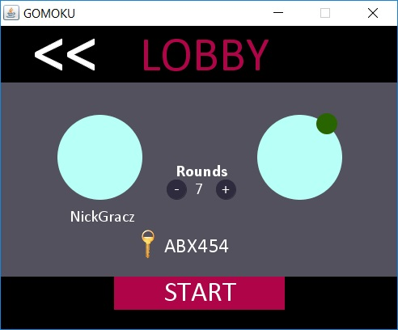

<h1>Gomoku</h1>

<h3>Data: 02.08.2017</h3>

<h3>Opis:</h3>
Gomoku to gra odbywająca się na planszy o rozmiarach 15x15. 
Gracze wykonują ruchy przemiennie jak w popularnej grze kółko i krzyżyk. 
Jedynym wyjątkiem jest moment przydzielenia punktu wygranej rundy, następuje ono wtedy gdy pięć znaków gracza znajduje się obok siebie.
Grę wygrywa gracz, który zdobędzie więcej punktów.

<h3>Tryby gry:</h3> 
- Gracz vs Bot 
- Online 1vs1

<h3>Biblioteki graficzne:</h3>
- AWT 
- Swing
 
<h3>Serwer: </h3>
- php (wyłączony)

<h3>Screeny:</h3>

